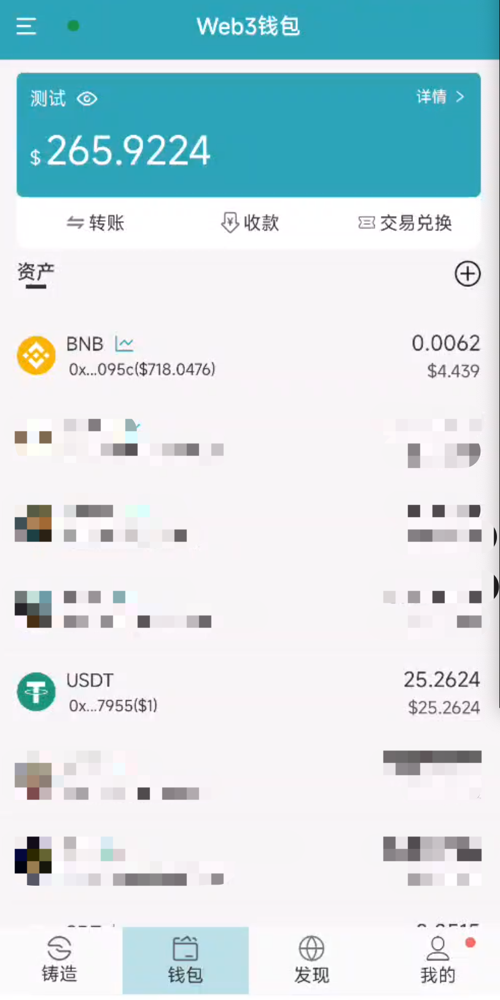
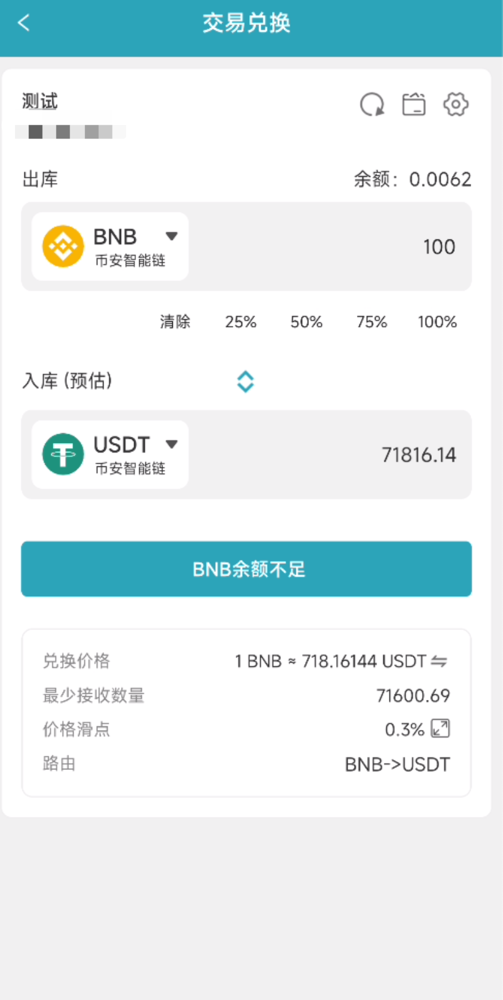
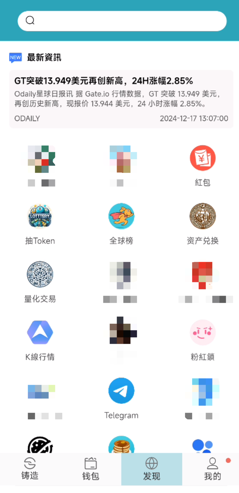

# Coin-Future   

>  声明1: 可定制开发智能合约、DAPP、web3APP、发代币、量化交易等
>  声明2: Web3智能合约源代码、APP源代码和GameFi源代码非开源（收费提供可定制）, 技术合作可联系email: pancakeswapai@gmail.com  

## 介绍

项目主要由BSC链智能合约+web3钱包APP+GameFi平台组成，可用于构建和二次开发，并拥有完整的系统组件，开发语言为Java、Python、Solidity、JS、TS，包含如下功能：
- BSC链智能合约发币与交易. 
- web3钱包APP
- 支持账户余额查询及转账功能
- 支持通过生成助记词、Keystore文件、私钥 创建钱包账号与导出
- 支持多个钱包账号管理
- 支持ERC20 代币（余额显示、转账、代币币价显示）
- 支持 DApp Browser 浏览器，兼容大多数DAPP，可关联钱包授权与交易
- 支持GameFi平台，包含多款web3游戏
- 支持代币铸造
- 支持推广奖励 
- 量化交易与兑换 
- 多语言支持 
- 支持币种管理、智能合约管理、代币管理、交易对管理、推广管理、活动管理、红包管理、游戏管理、节点管理等
  
## 特点
- 无后门，无需担心钱包安全问题
- 无需安装任何插件
- 团队技术支持，可定制源码

#### 部分截图
<table>
    <tr>
         <td width="33.33%"></td>
     <td width="33.33%"></td>
     <td width="33.33%"></td>
    </tr>
</table>
